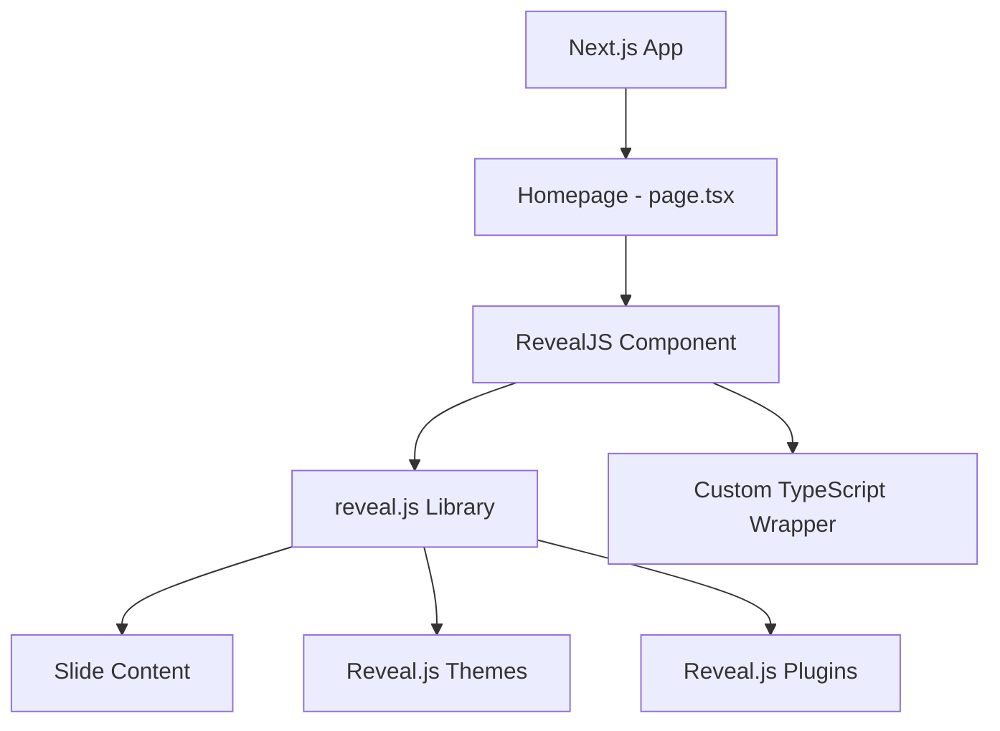
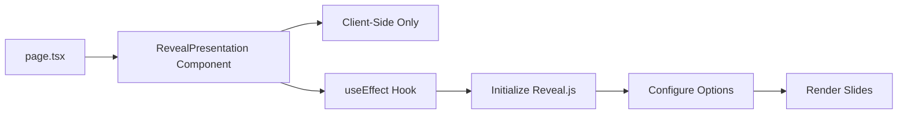

# Reveal.js Integration Plan

## Project Overview
Integration of Reveal.js slideshow presentation library into a Next.js 16 application using TypeScript and Bun as the package manager.

## Current Setup
- **Framework**: Next.js 16.1.4
- **Runtime**: Bun
- **Language**: TypeScript 5
- **React**: v19.2.3
- **Package Manager**: Bun
- **Linting/Formatting**: Biome

## Architecture Overview



## Implementation Strategy

### 1. Dependencies Installation

**Core Dependencies:**
- `reveal.js` - The core presentation framework
- `@types/reveal.js` - TypeScript type definitions

**Note:** After researching React wrappers for Reveal.js, we'll use a custom wrapper approach as it provides better compatibility with Next.js 16 and React 19.

### 2. Component Architecture



**Component Structure:**
- [`src/components/RevealPresentation.tsx`](src/components/RevealPresentation.tsx) - Main client component
- Slides defined declaratively using HTML structure
- TypeScript interfaces for configuration options

### 3. Key Implementation Details

**Client-Side Rendering:**
Since Reveal.js relies on browser APIs, we'll use the `'use client'` directive in Next.js to ensure client-side rendering.

**CSS Integration:**
Import Reveal.js CSS files directly into the component:
- Core reveal.css
- Theme CSS (e.g., black, white, league, etc.)
- Optional plugin styles

**Initialization Pattern:**
```typescript
useEffect(() => {
  const initReveal = async () => {
    const Reveal = (await import('reveal.js')).default;
    const deck = new Reveal({
      // configuration options
    });
    await deck.initialize();
  };
  initReveal();
}, []);
```

### 4. Configuration Options

**Recommended Reveal.js Configuration:**
- `hash: true` - Enable URL hash navigation
- `transition: 'slide'` - Slide transition effect
- `controls: true` - Show navigation controls
- `progress: true` - Show progress bar
- `center: true` - Center slides vertically
- `touch: true` - Enable touch navigation
- `loop: false` - Don't loop the presentation

### 5. File Structure

```
hackday_01_2026/
├── src/
│   ├── app/
│   │   ├── page.tsx (Updated to use Reveal component)
│   │   ├── layout.tsx (Existing)
│   │   └── globals.css (May need updates)
│   └── components/
│       └── RevealPresentation.tsx (New)
├── public/
│   └── slides/ (Optional - for images/assets)
├── package.json (Updated with new dependencies)
└── plans/
    └── reveal-js-integration-plan.md (This file)
```

### 6. Slide Content Structure

Slides will be created using HTML structure within the component:

```html
<div className="reveal">
  <div className="slides">
    <section>Slide 1</section>
    <section>Slide 2</section>
    <section>
      <section>Vertical Slide 1</section>
      <section>Vertical Slide 2</section>
    </section>
  </div>
</div>
```

### 7. TypeScript Integration

**Type Safety:**
- Import types from `@types/reveal.js`
- Create interfaces for component props
- Define configuration options with proper types

**Example:**
```typescript
import type Reveal from 'reveal.js';

interface RevealConfig {
  transition?: 'none' | 'fade' | 'slide' | 'convex' | 'concave' | 'zoom';
  controls?: boolean;
  progress?: boolean;
  // ... other options
}
```

### 8. Styling Approach

**CSS Import Strategy:**
1. Import Reveal.js core CSS globally in component
2. Import chosen theme CSS
3. Custom styles can be added via CSS modules or globals.css
4. Ensure proper z-index and layout for full-screen presentation

### 9. Navigation & Controls

**Built-in Navigation:**
- Arrow keys (←, →, ↑, ↓)
- Space bar for next slide
- Home/End keys
- ESC for overview mode
- 'S' for speaker notes (if enabled)

**Touch Support:**
- Swipe gestures on mobile devices
- Pinch to zoom

### 10. Testing Checklist

- [ ] Presentation loads without errors
- [ ] Slides navigate correctly (keyboard)
- [ ] Slides navigate correctly (mouse/touch)
- [ ] Transitions work smoothly
- [ ] Progress bar updates correctly
- [ ] URL hash navigation works
- [ ] Responsive on different screen sizes
- [ ] No console errors
- [ ] TypeScript compilation succeeds
- [ ] Biome linting passes

## Sample Slide Content

The initial implementation will include:
1. **Title Slide** - Project introduction
2. **Content Slide** - Main content with bullet points
3. **Code Slide** - Code snippet example
4. **Image Slide** - Image with caption
5. **Final Slide** - Thank you / Q&A

## Potential Enhancements (Future)

- Add plugins (Speaker Notes, Math, Markdown support)
- Create slide templates as separate components
- Add animations and custom transitions
- Integrate with a CMS for dynamic content
- Export to PDF functionality
- Speaker notes view
- Presentation timer

## Dependencies to Install

```bash
bun add reveal.js
bun add -d @types/reveal.js
```

## Development Commands

```bash
# Install dependencies
bun install

# Run development server
bun dev

# Build for production
bun build

# Run linter
bun lint

# Format code
bun format
```

## Browser Compatibility

Reveal.js supports all modern browsers:
- Chrome/Edge (latest)
- Firefox (latest)
- Safari (latest)
- Mobile browsers (iOS Safari, Chrome Mobile)

## Performance Considerations

- Lazy load Reveal.js library using dynamic imports
- Optimize images in slides
- Minimize custom CSS
- Use built-in transitions for better performance
- Consider reducing slide complexity for mobile devices

## Security Considerations

- Sanitize any user-generated content in slides
- Be cautious with embedded iframes
- Review third-party plugins before adding

## Conclusion

This plan provides a solid foundation for integrating Reveal.js into your Next.js application. The implementation will replace the homepage with a fully functional slideshow presentation while maintaining TypeScript type safety and compatibility with Bun and Next.js 16.
